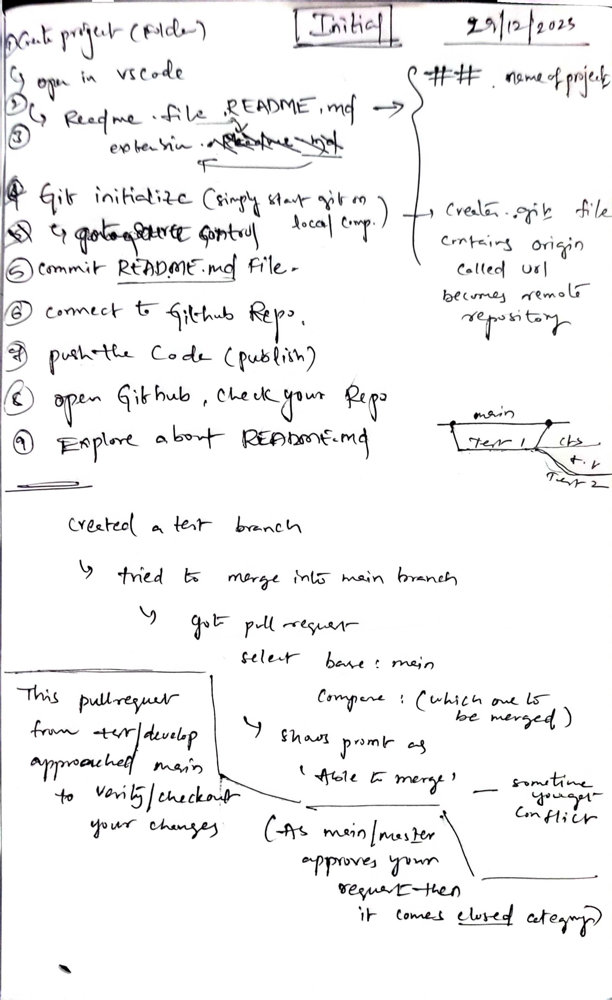

## Learing Git from VSCODE
- Hi! Everyone I am @abdulazeez20 testing out git branches.

### Checkout my 1st pull request☝️
#### Google this : how to merge a branch into main
- checked this (but not relevant) : https://phoenixnap.com/kb/git-merge-branch-into-master
- figured out on my own refer in the assets notes for clear understanding.

#### Google this : how to add images in md
- link : https://stackoverflow.com/questions/14494747/how-to-add-images-to-readme-md-on-github
- 

